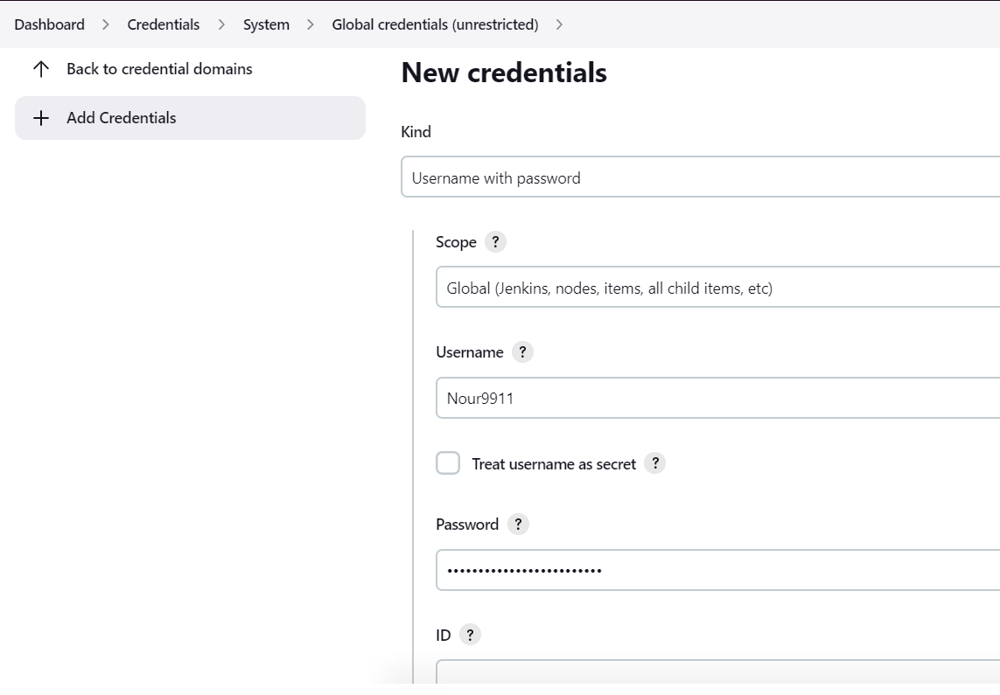

# AssignmentDEVOPS 

#### Made by:

- Nour MRAD


#### Requirements:
```
Postgres 15.0 (BD: assignmentBD)
STS (Spring Tools Suite) for the backend java application
NodeJS
Webstorm, Intellij (or others) for the frontend angular application
 
```
#### Notes for the frontend:

Step 0 : npm install (If you are planning to run it on your host machine)

Step 1 : Login with the User you created

Step 2 : Add a simple stock (we are going to need it to affect a stock to a product)

Step 3 : Add a product (I did an optional test where I embedded a Youtube link and not an image, so you must put a Youtube link in the url input )

Step 4 : Add to card and go to the card icon you will see the product(s) with 

Step 5 : Press command now to do a simple purchase

Step 6 : Click on " Check your bills " to see your purchased items

==> I used Jenkins for our pipeline continuous integration part, to use it we have to:

    - Create a new pipeline

    - Go to the piepeline conguration and make sure that you insert your gitlab url and branch (if you can't run gitlab projects on Jenkins you have to generate a token access in your gitlab profile then put it in jenkins's credential configuration)



Kind : Username with password ( because we are using a token and not ssh) 

Username : gitlab username

password : your token

     - Build your pipeline and it will create a frontend image, push it in my dockerhub account so we can pull it to deploy it (this pipeline should be build before the backend pipeline)


[Backend with Spring BOOT Java](https://gitlab.com/Nour9911/internassignmentbackend.git
).

[Frontend with Angular JS](https://gitlab.com/Nour9911/internassignmentfrontend.git
).


